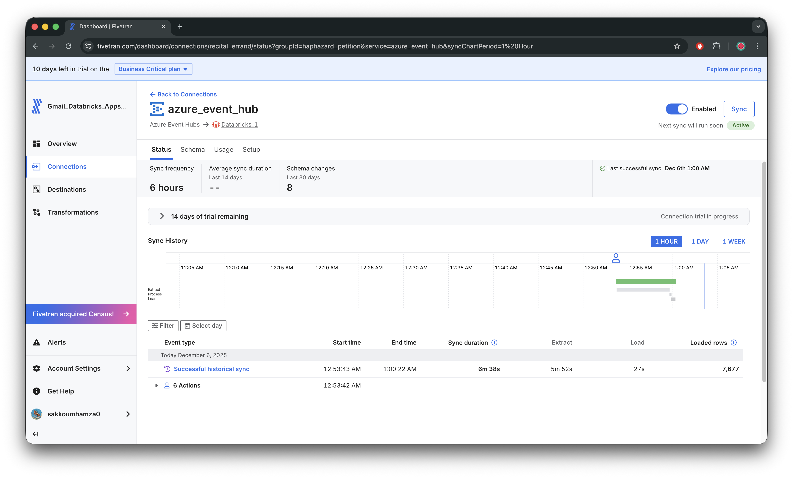
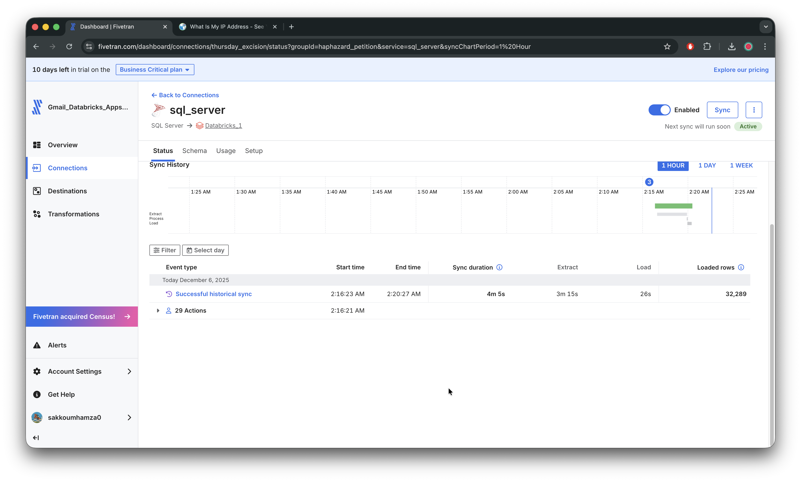

# 🚗 Insurance Data Lakehouse - Data Ingestion Layer

This project implements a modern data lakehouse architecture for insurance claim processing, focusing on real-time streaming ingestion and SQL Server data integration using Databricks and Azure services.

## 🏗️ Architecture Overview

The ingestion layer consists of 3 primary data pipelines:

1. **Streaming Ingestion** - Real-time telematics data via Azure Event Hub ingested by Fivetran
2. **SQL Server Ingestion** - On-Prem Batch and CDC ingestion via Fivetran
3. **BLOB storage images Ingestion** - Images ingestion via AutoLoader


## 📊 Data Sources

### Streaming Data (Telematics)

- **Source**: IoT devices and vehicle sensors
- **Format**: Azure Event hub Stream
- **Volume**: Real-time streaming data
- **Ingestion Method**: Fivetran Connector with CDC

### SQL Server Data (Claims & Policies)
- **Source**: Legacy On Prem SQL Server database
- **Tables**: Claims, Customers, Policies
- **Ingestion Method**: Fivetran connector with CDC (Change Data Capture)
- **Format**: CSV exports and real-time changes

## 🚀 Streaming Ingestion Pipeline

### Overview
The streaming pipeline ingests real-time telematics data from vehicle sensors through Azure Event Hub into Databricks for processing.



### Components

#### 1. Event Hub Producer (`code/01_streaming_ingestion/event-hub.py`)
- Reads telematics parquet files from `data/telematics/` directory
- Converts data to JSON format
- Streams data to Azure Event Hub in batches
- Supports configurable connection strings via `conf.conf`

#### Key Features:
- **Batch Processing**: Processes multiple parquet files sequentially
- **JSON Serialization**: Converts DataFrame rows to JSON messages
- **Error Handling**: Robust configuration file parsing
- **Scalable**: Batch sending for optimal performance

#### Configuration Setup:
1. Copy `conf-example.conf` to `conf.conf`
2. Add your Azure Event Hub connection string:
```ini
[EVENT_HUB]
connection_string = "Endpoint=sb://your-eventhub.servicebus.windows.net/;SharedAccessKeyName=your-policy;SharedAccessKey=your-key"
```

#### Usage:
```python
python code/01_streaming_ingestion/event-hub.py
```

## 🗄️ SQL Server Ingestion Pipeline

### Overview
The SQL Server pipeline handles both initial bulk data loading and ongoing change data capture (CDC) for claims, customers, and policy data.



### Components

#### 1. Database Initialization (`code/02_Sql_Server_Ingestion/db_init.sql`)
- Sets up the claims database structure
- Enables Change Data Capture (CDC)
- Enables Change Tracking (CT)
- Creates necessary schemas and permissions

#### 2. Data Loading (`code/02_Sql_Server_Ingestion/db_ingestion.sql`)
- Creates staging tables for raw CSV data
- Bulk imports from mounted CSV files
- Handles data cleansing and validation
- Supports incremental loading patterns

#### 3. Fivetran Configuration (`code/02_Sql_Server_Ingestion/fivetran-config.sql`)
- Creates dedicated Fivetran user account
- Assigns minimum required permissions
- Enables CDC and Change Tracking
- Configures real-time replication settings

### Key Features:
- **Change Data Capture**: Real-time capture of data changes
- **Bulk Loading**: Initial data import from CSV files
- **Security**: Dedicated service account with minimal permissions
- **Incremental Sync**: Efficient delta loading via Fivetran

### Data Tables:
- **Policies**: Insurance policy details, coverage, premiums
- **Claims**: Claim records, status, amounts
- **Customers**: Customer information, demographics


## 📋 Prerequisites

- **Azure Event Hub** namespace and event hub
- **SQL Server** 2017+ with Agent service
- **Fivetran** account with SQL Server connector
- **Databricks** workspace


### File Structure
```
code/
├── 01_streaming_ingestion/
│   ├── event-hub.py          # Event Hub producer
│   ├── conf.conf             # Connection configuration
│   └── conf-example.conf     # Configuration template
│
└── 02_Sql_Server_Ingestion/
    ├── db_init.sql           # Database setup
    ├── db_ingestion.sql      # Data loading
    ├── fivetran-config.sql   # Fivetran setup
    └── ddl_support_objects.sql # Supporting objects
```

## 📈 Monitoring & Troubleshooting

### Streaming Pipeline
- Monitor Event Hub metrics in Azure Portal
- Check Databricks streaming job logs
- Validate data flow in Delta tables

### SQL Server Pipeline
- Monitor Fivetran connector status
- Check SQL Server Agent job logs
- Validate CDC function status

## 🎯 Next Steps

After successful ingestion setup:
1. **Medallion Architecture**: Bronze → Silver → Gold transformations
2. **Machine Learning**: Fraud detection and risk scoring
3. **Analytics**: Real-time dashboards and reporting

---

**Author**: Sakkoum Hamza  
**Date**: December 2025  
**Version**: 1.0