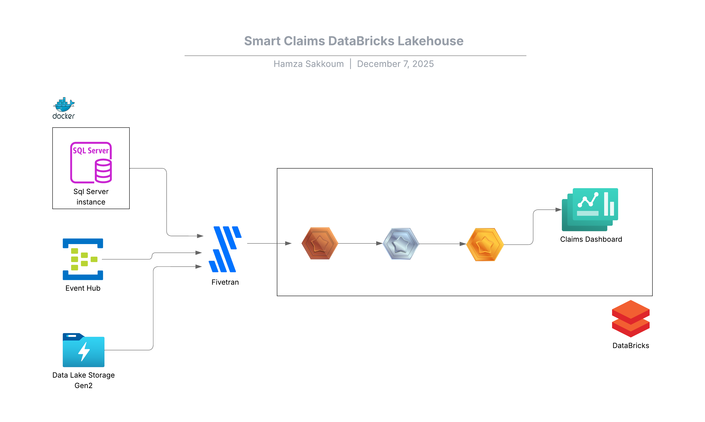
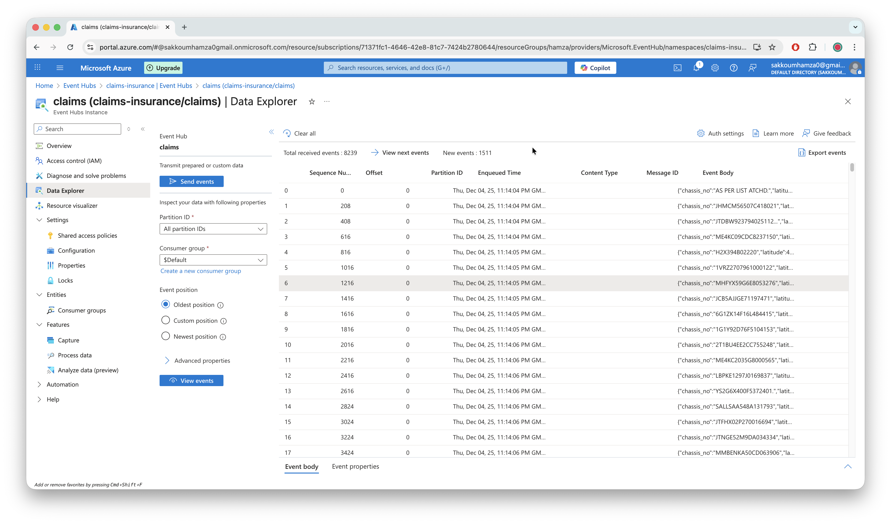
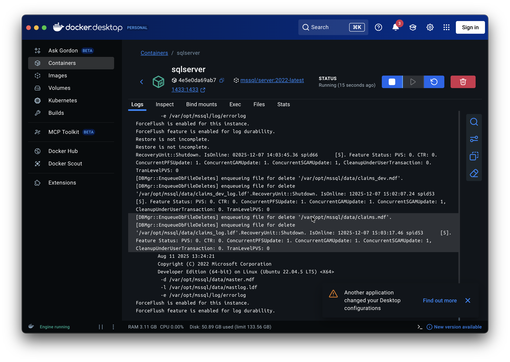
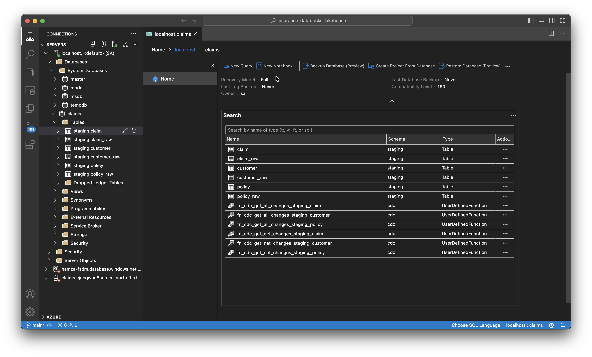
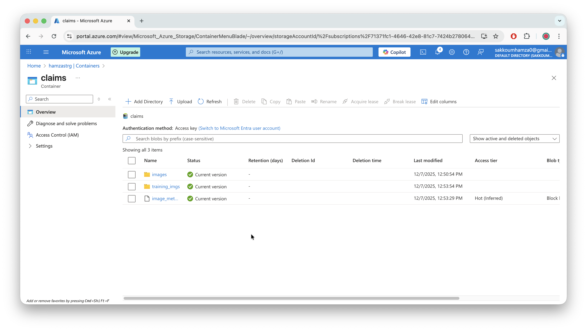
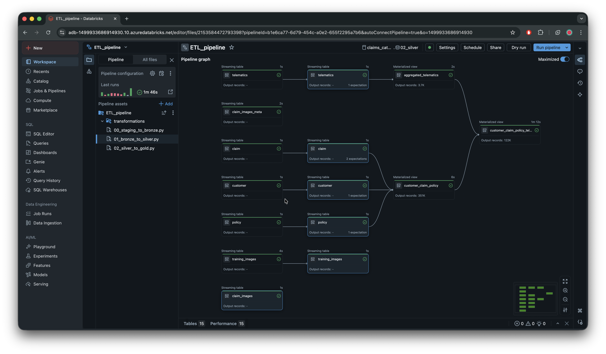
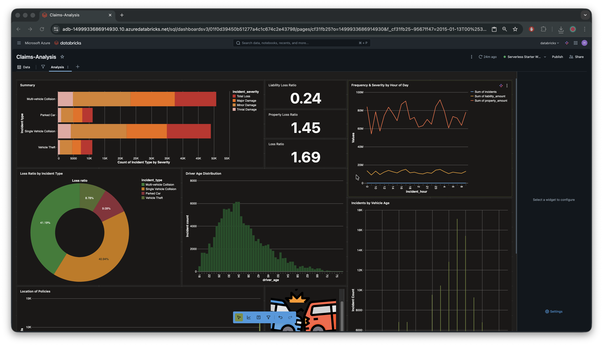

# 🚗 Smart Insurance DataBricks Lakehouse 

This project implements a modern data lakehouse architecture for insurance claim processing & future inference, focusing on real-time streaming & Batch ingestion, On Prem & Cloud based data sources integration using Fivetran, Databricks.

## 📋 Prerequisites

- **Azure Event Hub & ADLS Gen2** namespace & event hub and BlobStorage
- **SQL Server** 2017+ with Agent service
- **Fivetran** integration tool
- **Databricks** workspace

## 🏗️ Architecture Overview

---

<!---------------------------------------------------------------------------->
## 📊 Data Sources
<!---------------------------------------------------------------------------->

### 1. Event Hub Stream

- **Source**: IoT devices and vehicle sensors
- **Format**: Azure Event hub Stream
- **Volume**: Real-time streaming data

### 2. On prem SQL Server Running in Docker

- **Source**: Legacy On Prem SQL Server database runing on a Docker container 
- **Tables**: Claims, Customers, Policies
- **Ingestion Method**: Fivetran connector with CDC (Change Data Capture)

---

Azure Data Studio connected to the SQL Server container.
The `claims` database is expanded, showing:

- Staging tables:
  - `claim`, `claim_raw`
  - `customer`, `customer_raw`
  - `policy`, `policy_raw`

- CDC functions created after enabling Change Data Capture:
  - `fn_cdc_get_all_changes_staging_*`
  - `fn_cdc_get_net_changes_staging_*`

### 3. Blob storage images & metadata

The `claims` container in Azure Blob Storage is organized into three folders:

- **images/** – Raw claim-related images (accident photos, vehicle damage, document scans).

- **training_imgs/** – Images used strictly for ML experimentation (labeled data, preprocessed datasets, synthetic samples). This folder is separate from the main ingestion flow.

- **image_metadata/** – Metadata files (CSV/JSON) describing each image, including file paths, claim IDs, timestamps, and labels. This data is used to join images with claims and policies in downstream processing.

---
 

<!---------------------------------------------------------------------------->
## 🚀 Fivetran Ingestion
<!---------------------------------------------------------------------------->

### Overview
Ingests real-time telematics data from vehicle sensors through Azure Event Hub into Databricks for processing.

## 🗄️ SQL Server  

### Overview
The SQL Server pipeline handles both initial bulk data loading and ongoing change data capture (CDC) for claims, customers, and policy data.

## 🗄️ Blob Storage Ingestion

---

<!---------------------------------------------------------------------------->
## 🚀  ETL Pipeline with Delta live tables and Lakeflow piplines
<!---------------------------------------------------------------------------->

This pipeline implements the full end-to-end ingestion and transformation flow for claims, policies, customers, telematics, and image metadata using Databricks Delta Live Tables (DLT).

The pipeline is organized into three logical layers implementing the Medallion Architerctuere:

- **Bronze**: Raw streaming tables

- **Silver**: Cleaned and standardized streaming tables

- **Gold**: Business-ready materialized views

---

<!---------------------------------------------------------------------------->
## 📊 Claims Analysis Dashboard
<!---------------------------------------------------------------------------->

This dashboard provides a complete analytical view of insurance claim severity, frequency, customer demographics, vehicle behavior, and geographic policy distribution.  
It consolidates multiple business KPIs and visual insights to support **underwriting**, **portfolio monitoring**, and **claims operations**.

---

### ⭐ Purpose of This Dashboard

This dashboard enables stakeholders to explore and understand the insurance dataset through:

- Claim pattern analysis  
- Loss ratio monitoring  
- Temporal incident modeling  
- Customer and vehicle demographic insights  
- Spatial policy distribution  
- Claim severity segmentation  

<!---------------------------------------------------------------------------->
## 🚀  Next steps : Fraud Detection using FineTuned ResNet model 🔜
<!---------------------------------------------------------------------------->

**Author**: Sakkoum Hamza  
**Date**: December 2025  
**Version**: 1.0